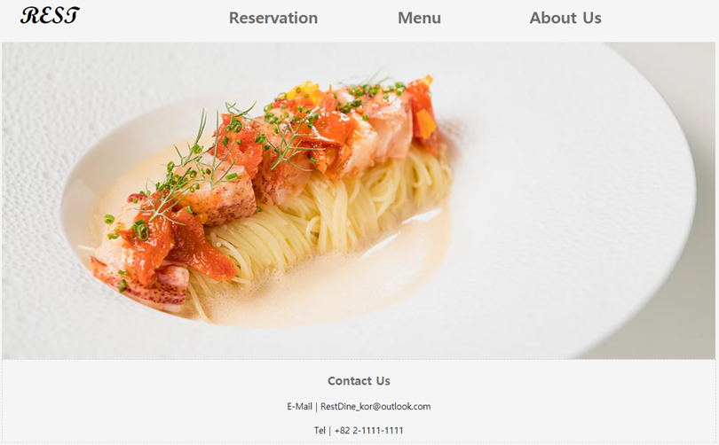
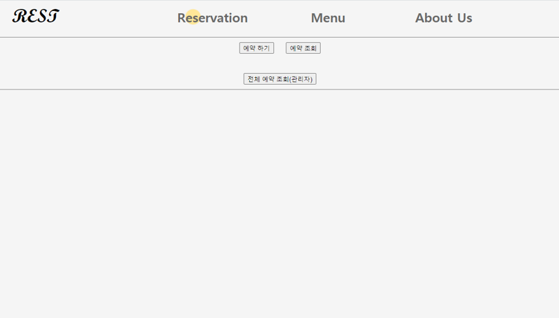
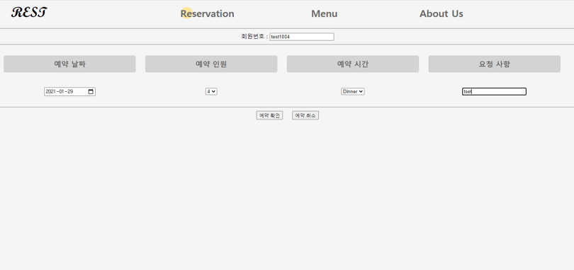
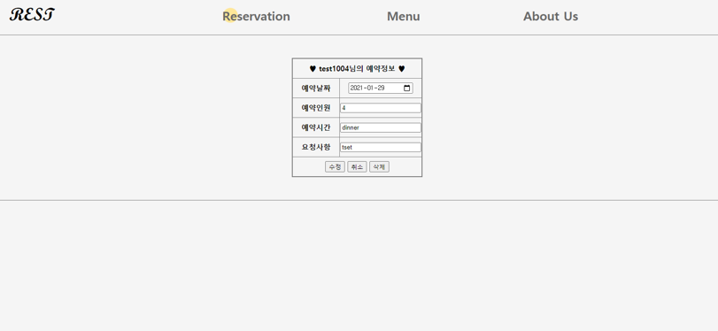
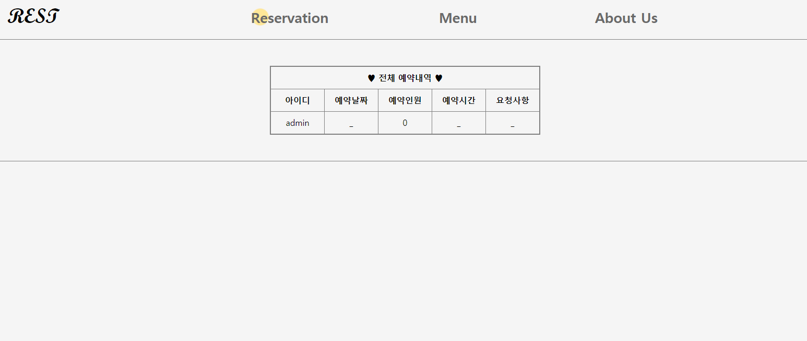
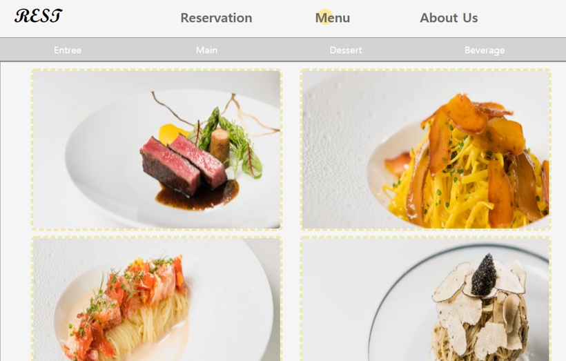
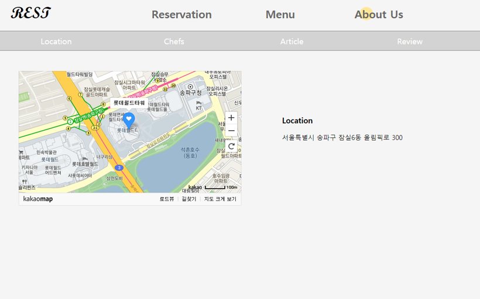

# 🍴 Res_Dinning

> 레스토랑과 예약 서비스 사용자를 위한 Web 어플리케이션

              

사용자의 레스토랑 예약, 관리자의 회원 및 예약 관리, 레스토랑 정보 제공 등

  

## 미리보기
> #### 메인화면

🧡시그니처 메뉴 사진과 함께 연락처 제공하는 메인화면

 

 

> #### 예약, 변경, 취소, 조회 

💛사용자와 관리자가 예약 서비스를 이용할 수 있는 예약화면

 

💛회원번호 입력 후, 예약 진행

 

💛회원번호 입력 후, 예약 내역 확인 : 예약 수정, 예약 취소, 예약화면으로 돌아가기 가능

 

💛관리자 로그인 후, 모든 예약 정보 조회 가능

 

 

> #### 메뉴소개

💚레스토랑 메뉴를 코스별로 소개할 수 있는 화면

 

 

> #### 소개화면

🖤레스토랑 위치, 요리사, 관련기사, 리뷰를 제공하는 화면

